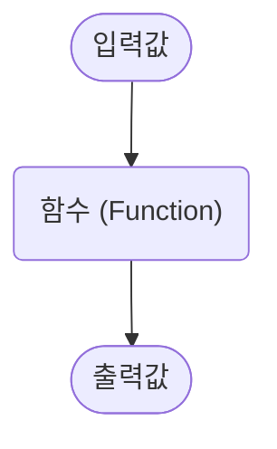
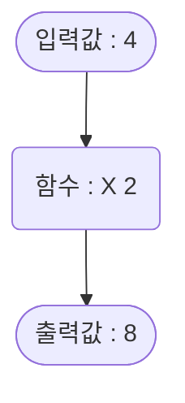

## 함수란?

함수(Function)는 `입력값`을 받아 일정한 규칙에 따라 `출력값`을 생성하는 관계를 의미합니다.



예를 들어, 다음과 같은 함수가 있다고 가정해봅시다.

```
입력값이 1 -> 출력값이 2, 
입력값이 2 -> 출력값이 4, 
...
입력값이 x -> 출력값이 y
```

이 함수에서는 항상 `출력값(y)`이 `입력값(x)`의 두 배입니다. 즉, 이 함수는 **입력값을 두 배로 변환하는 규칙**을 따릅니다.



이처럼 함수는 일정한 규칙을 가지고 입력값을 출력값으로 변환합니다.


## 함수의 수식 표현

함수는 일반적으로 𝑓로 나타내며, 수식으로는 다음과 같이 표현할 수 있습니다.

$$
f(x) 
$$

여기서 **x**는 `입력값`을 의미합니다.

`출력값`을 **y**로 표기할 경우, 함수의 관계는 다음과 같이 표현할 수 있습니다.

$$
y = f(x)
$$

예를 들어, 입력값을 4배로 출력하는 함수는 다음과 같이 쓸 수 있습니다.

$$
f(x) = x \times 4
$$

따라서 `출력값` **y**는 다음과 같습니다.

$$
y = x \times 4
$$

이처럼 함수는 입력값과 출력값의 관계를 명확하게 나타내는 도구이며, 이를 수식으로 표현하면 보다 직관적으로 이해할 수 있습니다.
