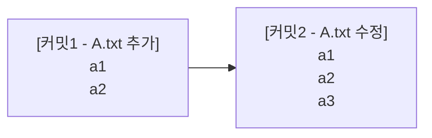
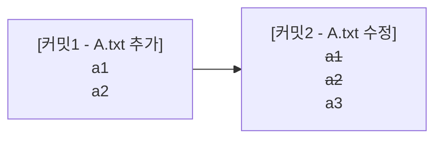

## 스냅샵 VS 델타 방식

버전 관리에서 **스냅샷** 방식과 **델타** 방식은 두 가지 주요 방식입니다. 각 방식은 **버전 관리 시스템**에서 파일들의 변경 이력을 어떻게 저장하고 관리할지에 대한 접근 방식이 다릅니다.

### 1. 스냅샷 방식 (Git)

Git은 **스냅샷 방식**을 사용하여 버전 관리합니다. 이 방식에서는 **각 커밋마다 파일들의 전체 상태를 기록**합니다. 즉, 커밋이 이루어질 때마다 해당 시점의 **파일 전체를 "스냅샷"으로 저장**합니다.

**예시:**

- **커밋1**: A.txt 파일이 처음 추가되고, 그 파일의 내용은 `a1`, `a2`입니다. 이 내용이 **스냅샷**으로 저장됩니다.
- **커밋2**: A.txt 파일이 수정되어 새로운 내용 `a3`이 추가됩니다. 이 파일의 **전체 상태** (`a1`, `a2`, `a3`)가 다시 **스냅샷**으로 저장됩니다.

Git은 **파일이 수정되었을 때** 그 파일의 **전체 내용을 다시 저장**하기 때문에, 변경된 부분만을 추적할 필요가 없습니다. 대신, 각 커밋은 독립적인 **스냅샷**을 가지며, 이를 통해 **빠른 복원**과 **확인**이 가능합니다.

### 2. 델타 방식 (SVN 등)

델타 방식은 **변경된 부분만 기록**하는 방식입니다. 이 방식은 **수정된 내용만을 기록**하고, 이전 상태는 **기존 파일을 덮어쓰는 형태**로 관리됩니다.

**예시:**

- **커밋1**: A.txt 파일이 추가되었고, 그 내용은 `a1`, `a2`입니다. 이 내용이 기록됩니다.
- **커밋2**: A.txt 파일에서 새로운 내용 `a3`이 추가됩니다. 이 커밋에서는 **변경된 내용만** 기록됩니다. 즉, 3번째 줄에 `a3`가 추가된 내용만 저장 됩니다.

델타 방식은 **변경 사항만 추적**하므로 **저장 공간**을 적게 사용할 수 있습니다. 그러나 변경 사항을 기록할 때마다 이전 상태와의 **차이점**만을 저장하기 때문에, 나중에 특정 버전으로 체크아웃하려면 **모든 델타를 적용**해야 하는 **불편함**이 있습니다.

### 3. 장단점 비교

#### **저장 공간**

- **스냅샷** 방식은 **전체 파일을 저장**하기 때문에 저장 공간을 더 많이 사용할 수 있습니다.
- **델타** 방식은 **변경된 부분만 저장**하므로, 파일의 변경 이력이 많을수록 **저장 공간**을 절약할 수 있습니다.

#### **체크아웃 속도**

- **스냅샷 방식**은 각 커밋이 **독립적**으로 저장되어 있어, 특정 커밋을 체크아웃할 때 **전체 스냅샷**을 빠르게 복원할 수 있습니다.
- **델타 방식**에서는 **모든 델타를 순차적으로 적용**해야 하므로, 특정 버전으로 체크아웃하려면 **수많은 델타를 계산**하고 **적용**해야 합니다. 예를 들어, 커밋이 1000개가 쌓인 경우, 500번째 커밋으로 체크아웃하려면 1번째부터 500번째까지의 모든 델타를 적용해야 하므로 **체크아웃 속도**가 상대적으로 느려질 수 있습니다.

## 스냅샷 방식으로 동작하는 실제 예시 (Git)

### 커밋 흐름


### 1. 커밋 A: 파일 추가

- **A.txt**, **B.txt**, **C.txt** 파일을 처음 추가
    
    - A.txt 내용:
		```plaintext
		a1
		a2
		a3
		```
        
    - B.txt 내용:
		```plaintext
		b1
		b2
		b3
		```
        
    - C.txt 내용:
		```plaintext
		c1
		c2
		c3
		```
        
- **스냅샷 저장**: 커밋 A에서 각 파일을 전체 스냅샷으로 저장합니다.
    
    - A.txt -> A1
    - B.txt -> B1
    - C.txt -> C1
    
	```mermaid
	block-beta
	
	columns 5
	
	A1 B1 C1
	```
    
- **커밋 A 내용**: A1, B1, C1
    

---

### 2. 커밋 B: A.txt 수정

- **A.txt** 파일을 수정:
	```plaintext
	a1
	a2
	a3
	a4
	```
    
- **스냅샷 저장**: 수정된 **A.txt**만 새로운 스냅샷으로 저장합니다.
    
    - A.txt -> A2 (B 커밋에서 수정된 A.txt 내용)
    - B.txt와 C.txt는 변경되지 않았으므로 그대로 B1, C1을 유지
    
	```mermaid
	block-beta
	
	columns 5
	
	A1 B1 C1 A2
	```
    
- **커밋 B 내용**: A2, B1, C1
    

---

### 3. 커밋 C: B.txt 수정

- **B.txt** 파일을 수정:
	```plaintext
	b1
	b2
	b3
	b4
	```
    
- **스냅샷 저장**: 수정된 **B.txt**만 새로운 스냅샷으로 저장합니다.
    
    - A.txt는 커밋 B에서 이미 수정된 상태인 A2를 그대로 유지
    - B.txt -> B2 (C 커밋에서 수정된 B.txt 내용)
    - C.txt는 변경되지 않았으므로 그대로 C1을 유지
    
	```mermaid
	block-beta
	
	columns 5
	
	A1 B1 C1 A2 B2
	```
    
- **커밋 C 내용**: A2, B2, C1
    

---

### 체크아웃 과정

- **커밋 A로 체크아웃**

    - **A1, B1, C1** 스냅샷을 이용해 `A.txt`, `B.txt`, `C.txt` 파일을 복원합니다.
    - 결과: 초기 상태로 돌아가며, A.txt는 `a1, a2, a3`, B.txt는 `b1, b2, b3`, C.txt는 `c1, c2, c3` 내용이 복원됩니다.
      
- **커밋 B로 체크아웃**

    - **A2, B1, C1** 스냅샷을 이용해 `A.txt`, `B.txt`, `C.txt` 파일을 복원합니다.
    - 결과: A.txt는 `a1, a2, a3, a4` (B 커밋에서 수정된 내용), B.txt는 `b1, b2, b3`, C.txt는 `c1, c2, c3` 상태가 복원됩니다.
      
- **커밋 C로 체크아웃**

    - **A2, B2, C1** 스냅샷을 이용해 `A.txt`, `B.txt`, `C.txt` 파일을 복원합니다.
    - 결과: A.txt는 `a1, a2, a3, a4` (B 커밋에서 수정된 내용), B.txt는 `b1, b2, b3, b4` (C 커밋에서 수정된 내용), C.txt는 `c1, c2, c3` 상태가 복원됩니다.
