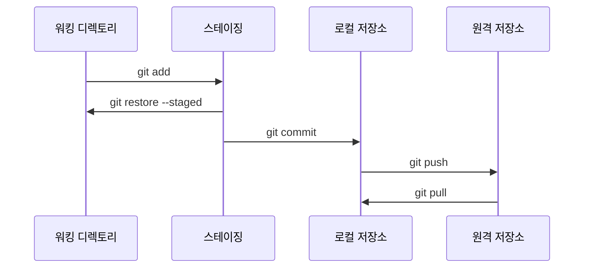

## 1. 워킹 디렉토리(Working Directory)

- 워킹 디렉토리는 현재 작업 중인 파일들이 실제로 저장된 공간입니다. 개발자는 이곳에서 파일을 수정하거나 새 파일을 생성합니다.
- 파일의 변경 사항은 Git에 의해 추적되지 않으며, `git add` 명령어를 통해 스테이징 영역으로 이동시킬 수 있습니다.

## 2. 스테이징(Staging Area)

- 스테이징은 워킹 디렉토리에서 발생한 변경 사항 중 커밋하고 싶은 부분만 선택하여 "대기"시키는 공간입니다.
- `git add` 명령어를 통해 파일을 스테이징에 추가하고, `git restore --staged` 명령어를 통해 스테이징된 파일을 되돌릴 수 있습니다.
- 이 단계에서 변경 사항은 아직 로컬 저장소에 저장되지 않으며, 커밋 준비가 완료된 상태입니다.

## 3. 로컬 저장소(Local Repository)

- 로컬 저장소는 커밋된 변경 사항이 실제로 저장되는 곳입니다. `git commit` 명령어를 통해 스테이징된 변경 사항을 로컬 저장소에 영구적으로 기록합니다.
- 로컬 저장소는 Git 프로젝트의 버전 기록을 관리하며, 로컬에서 작업한 변경 사항을 원격 저장소와 동기화할 수 있습니다.

## 4. 원격 저장소(Remote Repository)

- 원격 저장소는 GitHub, GitLab, Bitbucket 등과 같은 서버에 위치한 Git 저장소입니다. 여러 개발자들이 협업할 수 있도록 중앙 저장소 역할을 합니다.
- `git push` 명령어를 사용하여 로컬 저장소의 커밋을 원격 저장소에 업로드하고, `git pull` 명령어를 통해 원격 저장소의 변경 사항을 로컬 저장소로 받아올 수 있습니다.
