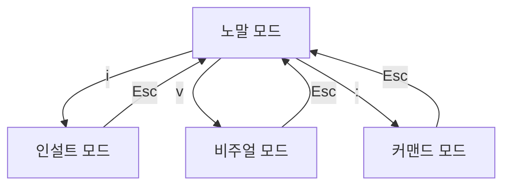

## 1. 노말 모드 (Normal Mode)

- 기본적인 모드로, 명령을 입력하여 텍스트를 편집할 수 있습니다.
- **다른 모드에서 `Esc` 키를 누르면 노말 모드로 돌아옵니다**

### 주요 기능

| 기능             | 키                                                            |
| ---------------- | ------------------------------------------------------------- |
| 커서 이동        | h (왼쪽), l (오른쪽), j (아래), k (위)                        |
| 단어 단위 이동   | w (다음 단어), b (이전 단어)                                  |
| 줄 단위 이동     | 0 (줄 맨 앞), ^ (첫 번째 글자), $ (줄 끝)                     |
| 화면 이동        | Ctrl+d (아래로 반 페이지), Ctrl+u (위로 반 페이지)            |
| 행 번호 이동     | `gg` (파일 맨 처음), `G` (파일 맨 끝), `숫자G` (해당 줄 이동) |
| 복사 (Yank)      | `yy` (한 줄 복사), `y` + `{motion}` (영역 복사)               |
| 삭제 (Delete)    | `dd` (한 줄 삭제), `d` + `{motion}` (영역 삭제)               |
| 잘라내기 (Cut)   | `d` (삭제와 동일)                                             |
| 붙여넣기 (Paste) | `p` (현재 커서 뒤), `P` (현재 커서 앞)                        |
| 실행 취소 (Undo) | `u`                                                           |
| 다시 실행 (Redo) | `Ctrl+r`                                                      |
| 바꾸기 (Replace) | `r` (한 글자 바꾸기), `R` (연속 입력)                         |
| 검색             | `/검색어` (아래 방향), `?검색어` (위 방향)                    |
| 검색 이동        | `n` (다음 검색 결과), `N` (이전 검색 결과)                    |
| 치환 (Replace)   | `:s/old/new/g` (한 줄), `:%s/old/new/g` (파일 전체)           |

## 2. 인설트 모드 (Insert Mode)

- 직접 텍스트를 입력하는 모드입니다.
- 노말 모드에서 다음 키를 입력하면 인설트 모드로 이동합니다.

### 인설트 모드 진입 키

| 키          | 기능                                      |
| ----------- | ----------------------------------------- |
| `i`         | 현재 커서 앞에서 입력 시작                |
| `I`         | 현재 줄의 첫 번째 글자 앞에서 입력 시작   |
| `a`         | 현재 커서 뒤에서 입력 시작                |
| `A`         | 현재 줄 끝에서 입력 시작                  |
| `o`         | 현재 줄 아래에 새 줄을 추가하고 입력 시작 |
| `O`         | 현재 줄 위에 새 줄을 추가하고 입력 시작   |
| `s`         | 현재 글자를 삭제하고 입력 시작            |
| `S`         | 현재 줄을 삭제하고 입력 시작              |
| `c{motion}` | 특정 영역을 삭제하고 입력 시작            |

## 3. 비주얼 모드 (Visual Mode)

- 텍스트를 블록으로 선택하여 편집할 수 있는 모드입니다.
- 노말 모드에서 `v`, `V`, `Ctrl+v` 를 입력하면 비주얼 모드로 이동합니다.

### 비주얼 모드 진입 키

| 키       | 기능                 |
| -------- | -------------------- |
| `v`      | 문자 단위 선택       |
| `V`      | 줄 단위 선택         |
| `Ctrl+v` | 블록(컬럼) 단위 선택 |

### 비주얼 모드에서 가능한 작업

| 기능             | 키                                     |
| ---------------- | -------------------------------------- |
| 복사 (Yank)      | `y`                                    |
| 삭제 (Delete)    | `d`                                    |
| 잘라내기 (Cut)   | `x`                                    |
| 붙여넣기 (Paste) | `p` (현재 커서 뒤), `P` (현재 커서 앞) |
| 대문자로 변환    | `U`                                    |
| 소문자로 변환    | `u`                                    |
| 들여쓰기         | `>`                                    |
| 내어쓰기         | `<`                                    |

## 4. 커맨드 모드 (Command Mode)

- 파일 저장, 종료, 검색 및 치환 등의 명령을 실행하는 모드입니다.
- 노말 모드에서 `:` 를 입력하면 커맨드 모드로 이동합니다.

### 주요 명령어

| 명령어          | 기능                           |
| --------------- | ------------------------------ |
| `:w`            | 파일 저장                      |
| `:q`            | 편집기 종료                    |
| `:q!`           | 변경사항 무시하고 종료         |
| `:wq` or `:x`   | 저장 후 종료                   |
| `:e 파일명`     | 새 파일 열기                   |
| `:set number`   | 줄 번호 표시                   |
| `:set nonumber` | 줄 번호 숨기기                 |
| `:s/old/new/g`  | 현재 줄에서 old를 new로 변경   |
| `:%s/old/new/g` | 전체 파일에서 old를 new로 변경 |
| `:noh`          | 하이라이트된 검색 결과 제거    |
| `:! 명령어`     | 외부 명령어 실행 (예: `:!ls`)  |
