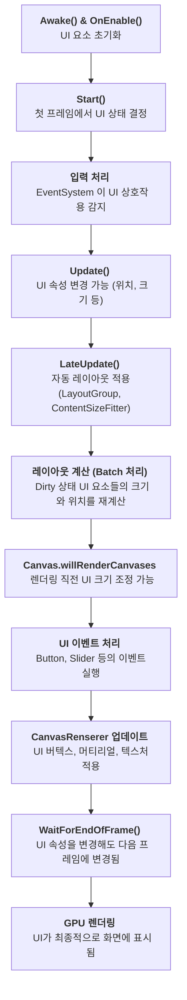

UGUI는 각 프레임 마다 정해진 특정 순서에 따라 UI 구성요소를 업데이트하고 렌더링 합니다. UGUI에서 레이아웃 계산과 렌더링이 언제, 어떤 순서로 실행되는지 라이프 사이클을 알아봅시다.

## UGUI 라이프 사이클



### 1. Awake() & OnEnable()

- `Canvas`, `RectTransform`, `Graphic`, `LayoutGroup` 등의 UI 관련 컴포넌트가 초기화됨.
- `RectTransform`의 기본 크기 및 위치가 설정됨.

### 2. Start()

- UI 요소들의 초기 상태가 결정됨.
- `LayoutGroup`과 `ContentSizeFitter` 등의 컴포넌트가 적용되어 UI 크기가 처음으로 설정됨.

### 3. 입력 처리

- `EventSystem`이 **마우스 클릭, 터치, 키 입력** 등을 감지.
- `GraphicRaycaster`가 **UI 요소에 대한 Raycasting**을 수행하여 상호작용할 UI 요소를 결정함.

### 4. Update()

- 게임 로직이 실행됨.
- `RectTransform.sizeDelta`, `anchoredPosition`, `scale` 등의 값이 변경될 수 있음.
- UI 애니메이션, 텍스트 변경, 버튼 클릭 등의 이벤트가 발생할 수 있음.

### 5. LateUpdate()

- `ContentSizeFitter`, `AspectRatioFitter`, `LayoutGroup` 등의 **자동 레이아웃 시스템이 UI 크기를 조정**하는 단계.
- `RectTransform`이 **Dirty(더티) 상태**가 되어, Unity가 이를 감지하고 다음 단계에서 재계산하도록 설정됨.
- `Canvas`가 업데이트됨.

### 6. 레이아웃 계산

- **Dirty 상태인 UI 요소들의 크기와 위치를 재계산하는 단계.**
- 실행되는 주요 시스템:
    - `Layout Group` → 부모 컨테이너의 크기를 결정
    - `ContentSizeFitter` → 자식 요소들의 크기에 맞춰 자동 조정
    - `AspectRatioFitter` → 비율을 유지하도록 크기를 조정

**이 단계에서 UI 요소의 크기 및 배치가 결정되며, 다음 단계에서 렌더링 준비가 진행됩니다.**

### 7. Canvas.willRenderCanvases 이벤트 실행

- `Canvas`가 **렌더링되기 직전**에 호출되는 콜백.
- UI 크기를 조정하거나 즉시 업데이트해야 한다면 **강제 업데이트가 필요**함.

```csharp
Canvas.ForceUpdateCanvases(); LayoutRebuilder.ForceRebuildLayoutImmediate(targetRectTransform); 
```

### 8. EventSystem에서 UI 이벤트 처리

- `Button`, `Toggle`, `Slider` 등의 UI 요소가 **클릭, 터치 등의 이벤트를 처리**하는 단계.
- `OnClick()`, `OnValueChanged()` 등의 UI 이벤트가 실행됨.

### 9. CanvasRenderer가 UI 메쉬 & 머티리얼 업데이트

- `CanvasRenderer`가 UI 요소의 **버텍스(Vertex), 머티리얼(Material), 텍스처(Texture)** 를 생성함.
- 같은 머티리얼을 공유하는 UI 요소들이 **Batching 최적화**됨.
- UI의 **알파 블렌딩, 마스크 적용, 텍스처 변경이 이 단계에서 반영**됨.
- `OnWillRenderObject()`가 호출됨 → **UI가 GPU로 렌더링되기 직전 실행되는 단계**.

### 10. WaitForEndOfFrame() 실행

- 이 시점에서 UI 렌더링 준비가 끝났기 때문에, `WaitForEndOfFrame()`에서 UI 속성을 변경해도 **즉시 반영되지 않고 다음 프레임에 적용됨.**

### 11. GPU에 UI 데이터를 전달 & 최종 렌더링

- `CanvasRenderer`가 UI를 **GPU로 넘기고 최종적으로 화면에 표시되는 단계.**
- `Screen Space - Overlay` → 가장 빠르게 렌더링됨.
- `Screen Space - Camera`, `World Space` → 3D 오브젝트처럼 카메라에서 렌더링됨.

## [부록. UGUI 라이프사이클 응용 사례](../ugui-life-cycle-s01)
