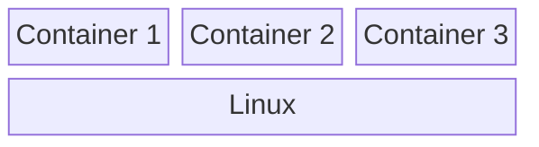
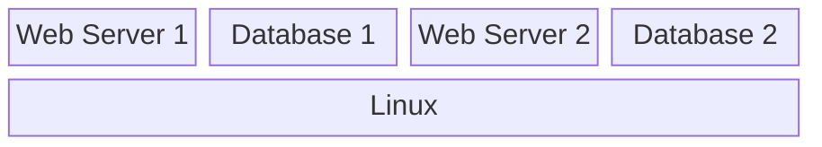
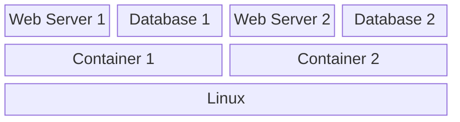
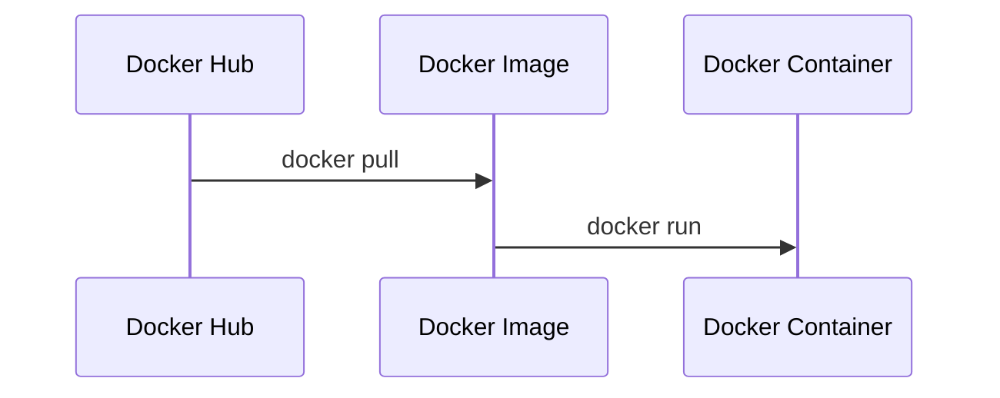
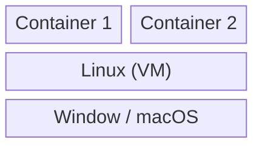

## 가이드

[0. Docker 시작하기](../docker-00)

---

## 리눅스 컨테이너

도커를 이해하기 전에 먼저 리눅스 컨테이너가 무엇인지 살펴보겠습니다.

리눅스 컨테이너는 가상 머신(VM)과 유사하게 독립적인 가상 환경을 제공하는 기술입니다. 그러나 가상 머신과의 차이점은 각 환경마다 별도의 운영체제(OS) 커널을 실행하는 것이 아니라, 하나의 리눅스 커널을 여러 개의 컨테이너가 공유하여 사용한다는 점입니다.

이로 인해 가상 머신처럼 여러 개의 OS 커널을 실행할 필요 없이, 보다 가볍고 효율적으로 격리된 환경을 제공할 수 있습니다.

---

## Docker

도커(Docker)는 리눅스 컨테이너 기술을 활용하여 독립적인 개발 환경을 제공하는 도구입니다.

소프트웨어를 개발할 때는 다양한 패키지와 라이브러리를 설치해야 합니다. 하지만 이러한 패키지는 운영체제 버전, 다른 패키지에 대한 의존성 문제 등 여러 변수로 인해 환경을 설정하는 과정이 복잡할 수 있습니다.

특히, 하나의 컴퓨터에서 여러 개의 서비스를 개발하다 보면 서로 다른 버전의 패키지가 충돌할 가능성이 큽니다.

예를 들어, 한 컴퓨터에서 두 개의 웹 서비스를 실행한다고 가정해 봅시다.

- 웹 서비스 1 (웹 서버 1, 데이터베이스 1)
- 웹 서비스 2 (웹 서버 2, 데이터베이스 2)

이때 두 웹 서비스에서 동일한 Database을 사용하지만, 각 서비스에서 요구하는 Database 버전이 다를 경우 문제가 발생할 수 있습니다.

이를 해결하기 위해 각 웹 서비스를 독립된 컨테이너에서 실행할 수 있습니다.

컨테이너를 사용하면 각 서비스의 실행 환경을 분리하여 패키지 및 라이브러리를 독립적으로 관리할 수 있습니다.

또한, 미리 설정된 개발 환경을 다른 사람과 공유하고, 동일한 환경을 그대로 실행할 수도 있습니다. 이러한 특성 덕분에 도커는 개발과 배포 과정을 더욱 효율적으로 만들어 줍니다.

---

## Docker의 동작 플로우

### Docker Image

도커 이미지는 개발 환경이 설정된 실행 가능한 파일로, 컨테이너를 생성하는 기반이 됩니다. Docker Hub와 같은 공식 저장소에서 다운로드할 수도 있고, 직접 생성할 수도 있습니다.

### Docker Container

도커 컨테이너는 도커 이미지를 실행하여 메모리에 적재된 상태를 의미합니다. 컨테이너가 실행 중일 때 해당 환경에 접속하여 애플리케이션을 운영할 수 있습니다.

---

## Window / macOS 에서 Docker

- Windows나 macOS와 같이 리눅스가 아닌 운영체제에서는 **가상 머신(VM)** 을 통해 리눅스 환경을 구성한 후, 그 위에서 Docker 컨테이너가 실행됩니다.
- 각 운영체제에서 Docker를 설치하면, 자동으로 리눅스 기반의 가상 머신이 생성됩니다.
- **가상 머신(VM)** 을 사용하기 때문에 리눅스에서 직접 Docker를 실행하는 것보다 성능이 다소 저하될 수 있습니다.
- 결국, Docker 컨테이너는 항상 **리눅스 환경에서 실행**되며, Windows나 macOS에서도 이 원리를 통해 동작합니다.
