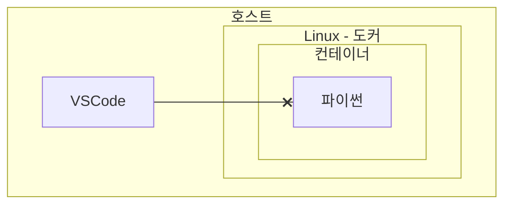
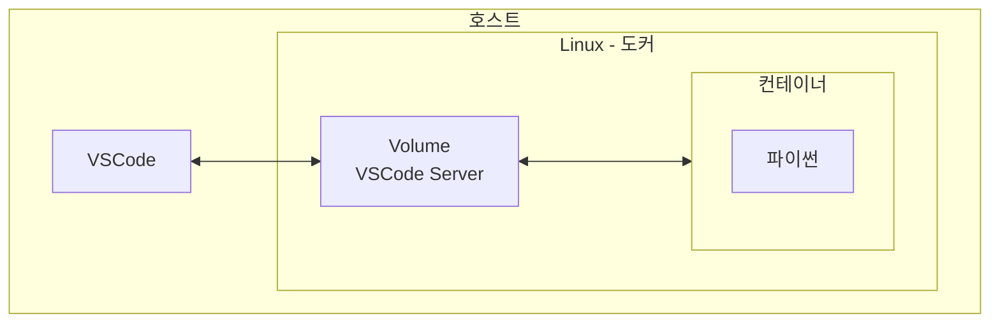

## 가이드

[0. Docker 시작하기](../docker-00)

---

## Devcontainer 란?

Docker를 사용해 파이썬이 설치된 컨테이너를 만들었다고 가정해 봅시다. 하지만 개발을 위해 호스트에서 실행한 VSCode는 컨테이너 내부의 파이썬을 직접 사용할 수 없습니다.

즉, 격리된 공간에서 개발 환경을 구성했지만, IDE를 제대로 활용할 수 없는 문제가 발생합니다.



이 문제를 해결하기 위해 VSCode는 **Devcontainer** 기능을 제공합니다. Devcontainer는 **VSCode Server**가 포함된 볼륨을 생성하고, 이를 컨테이너 이미지에 마운트하여 실행하는 방식으로 작동합니다.



이렇게 하면 VSCode는 컨테이너 내부의 VSCode Server를 통해 기존과 동일한 개발 환경을 유지할 수 있습니다.

---

## Devcontainer 구성 요소

Devcontainer를 사용하려면 `.devcontainer/devcontainer.json` 파일이 필요합니다.

### 1. Devcontainer 구성 요소 자동 추가

1. VSCode에 **Devcontainer 확장**이 설치되어 있다면, **명령어 팔레트(Ctrl + Shift + P)** 에서 **Dev Containers: Add Dev Container Configuration Files** 를 선택합니다.
2. **작업 공간에 구성 추가**를 선택합니다.    
3. 원하는 이미지를 검색하고 설치까지 진행합니다.

구성이 완료되면 `.devcontainer` 폴더가 생성되며, 내부에 `devcontainer.json` 등 필요한 파일이 추가됩니다.

### 2. Devcontainer 구성 요소 수동 추가

수동으로 `.devcontainer/devcontainer.json` 파일을 직접 작성할 수도 있습니다.

---

## devcontainer.json 구성 방법

`devcontainer.json` 파일은 Devcontainer를 구성하는 필수 파일입니다. 여러 가지 방법으로 설정할 수 있습니다.

### 1. Docker Hub 이미지를 사용하는 경우

```json
{
  "name": "Python 3",
  "image": "python:alpine",
  "customizations": {
    "vscode": {
      "extensions": [
        "ms-python.python"
      ]
    }
  }
}
```

- `image`: Docker Hub에서 제공하는 이미지 사용
- `extensions`: 컨테이너 내에서 사용할 VSCode 확장 기능

### 2. Dockerfile을 사용하는 경우

```json
{
  "name": "Python 3",
  "build": {
    "dockerfile": "./Dockerfile"
  },
  "customizations": {
    "vscode": {
      "extensions": [
        "ms-python.python"
      ]
    }
  }
}
```

```Dockerfile
FROM python:alpine
```

- `dockerfile`: 사용자 지정 Dockerfile을 사용해 컨테이너를 빌드할 때 사용

### 3. MS에서 제공하는 Devcontainer 이미지 사용

```json
{
  "name": "Python 3",
  "image": "mcr.microsoft.com/devcontainers/python:1-3.12-bullseye"
}
```

- **MS 공식 Devcontainer 이미지**를 사용하면, 기본적으로 VSCode 확장이 포함되어 있어 별도 설정이 필요 없음
- 공식 이미지는 [여기](https://containers.dev/) 또는 [이곳](https://mcr.microsoft.com/) 에서 검색 가능
- VSCode에서 **Dev Containers: Add Dev Container Configuration Files**를 실행하면 기본적으로 `mcr.microsoft.com/devcontainers/python:버전` 이미지를 사용함

### 4. 자주 사용되는 추가 옵션

- **build.dockerComposeFile**: 사용자 지정 `docker-compose.yml` 파일 경로
- **postCreateCommand**: 컨테이너 생성 후 실행할 명령어
- **postStartCommand**: 컨테이너 시작 후 실행할 명령어

자세한 옵션은 [공식 문서](https://aka.ms/devcontainer.json)에서 확인할 수 있습니다.

---

## Devcontainer 실행 방법

Devcontainer를 실행하고 제어하는 방법은 VSCode의 **명령어 팔레트(Ctrl + Shift + P)** 를 통해 간편하게 관리할 수 있습니다.

### 1. 빌드 및 실행

`.devcontainer/devcontainer.json` 파일의 설정이 완료되었다면,

**명령어 팔레트(Ctrl + Shift + P)** 에서

`Dev Containers: Rebuild and Reopen in Container`를 선택하여 Devcontainer를 빌드하고 실행합니다.

### 2. 원격 연결 닫기

원격 컨테이너에 접속한 상태에서 연결을 종료하려면,

`Remote: Close Remote Connection`을 실행하면 컨테이너 연결이 닫힙니다.

### 3. 원격 연결 다시 열기

다시 원격 컨테이너 환경에서 작업하려면,

`Dev Containers: Reopen in Container`를 실행하면 됩니다.
