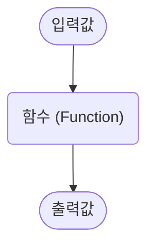

## 함수란?

함수는 `입력값`과 `출력값`이 존재하며, 입력값을 어떤 규칙에 따라 출력값으로 변환하는 관계를 의미합니다.



예를 들어, 다음과 같은 함수가 있다고 가정해봅시다.

```
입력값이 1 -> 출력값이 2, 
입력값이 2 -> 출력값이 4, 
...
입력값이 x -> 출력값이 y
```

이 함수에서 `출력값(y)`는 항상 `입력값(x)`의 두 배입니다. 즉, `입력값 -> 출력값`의 관계가 두 배 규칙을 따릅니다.


따라서, 이 함수의 규칙은 `입력값 x 2`로 요약할 수 있습니다.


## 수식으로 표현

함수는 일반적으로 f로 표현하며, 수식으로는 다음과 같이 나타냅니다.

$$
f(x) 
$$

여기서 **x**는 `입력값`을 의미합니다.

`출력값`을 **y**로 표기할 경우, 함수의 관계는 다음과 같이 표현할 수 있습니다.

$$
y = f(x)
$$

예를 들어, 입력값을 4배로 출력하는 함수는 다음과 같이 쓸 수 있습니다.

$$
f(x) = x \times 4
$$

따라서 `출력값` **y**는 다음과 같습니다.

$$
y = x \times 4
$$

이와 같은 방식으로 함수는 수식으로도 표현할 수 있습니다.
