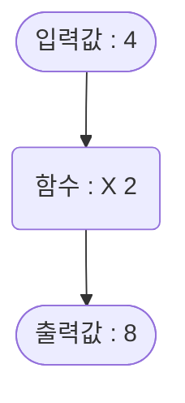

## 함수란?

함수란 `입력값`과 `출력값`이 있고 입력값 -> 출력값 이되는 `규칙`을 의미 합니다.


예를 들어서 

```
입력값이 1 -> 출력값이 2, 
입력값이 2 -> 출력값이 4, 
...
입력값이 x -> 출력값이 y
```

와 같은 함수가 있다고 했을때, 우리는 출력값(y)이 입력값(x)의 두배라는 `규칙`을 알 수 있습니다.



따라서 함수는 `X 2` 입니다.


## 수식으로 표현

함수(Function)의 첫 글자 f를 따서 수식으로는 이렇게 표현 합니다.

$$
f(x) 
$$

여기서 x는 `입력값`을 의미 합니다.

`출력값`(y로 표기)은 이렇게 표현할 수 있습니다.

$$
y = f(x)
$$

만약 입력값을 4배 해서 출력하는 함수가 있다면

$$
f(x) = x \times 4
$$

$$
y = x \times 4
$$

$$
x \times 4 = y
$$

와 같이 표현 할 수 있습니다.
